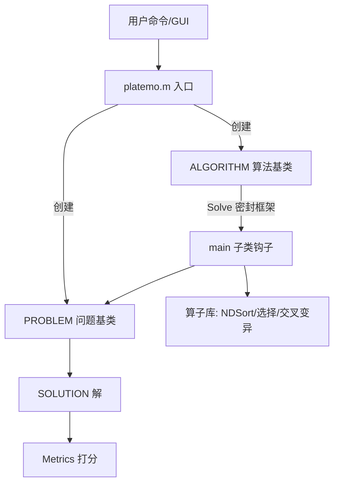

# guide.md 导航指南规范

> 深度带读模式在 Phase 7、完整实战模式在 Phase 9 生成 `guide.md` 时读取。`guide.md` 是学习者的**导航型指南**：帮助其从“一个功能/需求”导航到“具体文件的具体代码”。它不是教学讲义，而是**代码地图 + 导航手册**。

## 1. 定位与文件

- 文件名：`guide.md`，与 `course.html` 同目录（`notes/`）。
- 语言：与学习者一致（默认中文）。技术名词保留英文原文 + 白话解释。
- 篇幅：5-15 分钟可读完；核心是"快速定位"能力，不是长篇大论。

## 2. 完整结构模板

```markdown
# <项目名> 学习指南

> 学习日期：<日期> ｜ 学习方式：Project Learning SOP
> 一句话：<给谁用的、解决什么问题>
> 源码基线：<commit SHA；非 Git 项目标记文件快照时间>

## 1. 项目速览
| 项 | 内容 |
| --- | --- |
| 项目类型 | CLI / Web / 数据库 / 中间件 / 框架 / SDK / 科研平台 / 其他 |
| 语言/运行时 | <...> |
| 主要框架/范式 | <...> |
| 数据/存储 | <...> |
| 程序入口 | <文件/命令> |
| 启动方式 | <命令> |

## 2. 功能地图（从"用户能做什么"出发）
| 核心功能 | 用户如何触发 | 涉及目录/文件 | 代码入口（文件:行号） |
| --- | --- | --- | --- |
| <功能 1> | <操作/命令/界面动作> | <...> | <file.m:行> |
| <功能 2> | ... | ... | ... |

## 3. 目录结构导航
| 目录/文件 | 职责 | 备注（为什么重要） |
| --- | --- | --- |
| <src/> | <核心实现> | <识别要点：基类？入口？> |

## 4. 核心概念与架构
### 核心名词
| 名词 | 一句话职责 | 所在文件 |
| --- | --- | --- |
### 一句话架构
<A 创建 B，B 调用 C，C 管理 D……>
### 架构图
<mermaid flowchart + ASCII 备用，见第 3 节图表规范>
### 数据流图（一次典型操作）
<mermaid flowchart：标出数据/控制流经的组件与关键文件>

## 5. 功能 → 文件 → 代码导航表（★核心章节）
| 我想理解/修改什么 | 去哪个文件 | 看哪个函数/类 | 关键行号 | 备注 |
| --- | --- | --- | --- | --- |
| <如：登录逻辑> | <auth.service.js> | <login()> | <42-60> | <依赖/前置说明> |

## 6. 核心代码路径（调用链）
### 路径一：<功能名>
```
[入口] <文件>:<行> <函数>
  → <文件>:<行> <函数>（<一句话职责>）
  → ...
[末端] <输出/存储/返回>
```
### 路径二：<功能名>
...

## 7. 运行与测试
- 安装/启动/测试命令（代码块）
- 环境要求与已知坑（1-3 条）

## 8. 扩展指南（怎么改）
- 加<新功能/算法/问题/页面>的通用步骤
- "我想改 X，从哪里开始？"快速问答表

## 9. 术语表
| 术语 | 大白话解释 |
| --- | --- |

## 10. 还没理解 / 下一步
- [ ] <学习者存疑清单，作为下一步学习路线>
```

## 3. 图表规范（关键：选择"呈现方式较好的"图表）

图表是 guide.md 的加分项，按以下优先级选择呈现方式：

1. **mermaid 代码块（首选）**：架构图、数据流图、时序图用 ```mermaid 代码块，GitHub、Typora、VS Code 等主流渲染器均支持。
   - 架构图用 `flowchart`（如 `flowchart TB`，自上而下）。
   - 数据流用 `flowchart LR`（左右）并标注组件名 + 关键文件。
   - 交互时序可用 `sequenceDiagram`。
   - **每个 mermaid 图都要配套一段 ASCII 备用**（放同一节，标注"纯文本版"），保证在任何环境可读。
2. **ASCII 图**：mermaid 不可用/太复杂时，直接用等宽代码块画 ASCII 架构图。
3. **不生成外部图片资产**：最终交付严格为两个文件。复杂关系优先拆成多张小型 mermaid 图，并为每张图提供 ASCII 备用。

**图表纪律**：
- 一张图只表达一个主题（架构 / 数据流 / 时序），不要把所有信息塞进一张图。
- 节点用真实组件名 + 中文职责注释（如 `ALGORITHM.m(算法基类)`）。
- 数据流图必须标出**方向**（数据/控制从哪里到哪里），并用真实文件路径标注经过的代码位置。

### mermaid 架构图示例



### ASCII 备用示例

```text
用户命令/GUI → platemo.m → 创建 ALGORITHM + PROBLEM
                                  ↓
                     ALGORITHM.Solve（密封框架）
                                  ↓
                            main（子类钩子）
                            ├→ 算子库（NDSort/选择/GA）
                            └→ PROBLEM 评估 → SOLUTION
                                  ↓
                            Metrics 打分 → 结果
```

## 4. 功能 → 文件 → 代码导航表（写法要求）

这是用户最看重的章节，务必做到**可执行**：

- **行** = 学习者能想到的需求/疑问（"登录"、"缓存"、"导出报告"、"加个新算法"……）。
- **列** = 精确到文件 + 函数/类 + 行号，并以文档头部记录的源码基线为准。
- 每行只写一个仓库相对文件路径；跨文件功能拆成多行并用备注标明顺序。
- 每条必须来自**真实阅读过的代码**，不得臆造。核心导航行必须精确验证；补充信息若只能给近似行号，标注“约”并说明原因。
- 若一个功能跨多个文件，拆成多行或用"①→②→③"标注顺序。

## 5. 内容纪律

- 全部代码引用必须**原样复制**真实源码，标注文件路径。
- 术语表至少覆盖该项目的高频专有名词。
- "还没理解"清单是诚实的：写清楚而不是掩盖。
- guide.md 与 course.html 内容同源但**视角不同**：guide 是"查"（导航、定位、表格），course 是"学"（讲解、可视化、测验）。同一事实两处表述可复用，但呈现方式不同。

## 6. 自动验证

生成后运行：

```bash
python <skill-root>/scripts/validate_artifacts.py guide <learning-root>/notes/guide.md <repo-root> --min-rows 3
```

小于三个可导航功能的极小项目可把 `--min-rows` 调低，但必须在 `working.md` 记录原因。脚本必须返回 0 才能交付；校验后任何内容变化都会使结果失效，修改后必须重跑，并把最终成功校验作为交付前最后一步。
